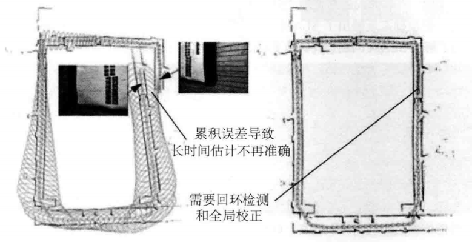

<details> 
<summary>

# slam14讲的笔记
</summary>

<details>
<summary>

ch1

</summary>

介绍[slam问题](https://zh.m.wikipedia.org/wiki/%E5%90%8C%E6%97%B6%E5%AE%9A%E4%BD%8D%E4%B8%8E%E5%9C%B0%E5%9B%BE%E6%9E%84%E5%BB%BA)(同时定位与建图)

一个slam系统分为以下几个模块：

- 视觉里程计
- 后端优化
- 建图
- 回环检测
---
本书分为两个部分：
- 数学部分
    * 介绍模块
    * 三维刚体运动
    * 李群和李代数
    * 相机模型
    * 非线性优化（ceres库和g2o库的使用

- 应用
    * > 第七讲讲了基于特征点法的视觉里程计，包括特征点提取和匹配，对极几何约束的计算，PnP, ICP。 本讲主要讲述如何计算相邻两帧的运动。
    * > 第八讲讲了基于直接法的视觉里程计，包括光流和直接法的实现，借此计算两个图像之家难得运动估计。

    * > 第九讲是对七八讲中涉及到的Bundle Adjustment(BA)的深入讨论，利用稀疏性加速求解
    
    * > 第十讲是介绍位姿图，包括SE(3)和Sim(3)

    * > 第十一讲通过以词袋方法为主的回环检测，使用DBoW3书写训练和回环程序

    * > 第十二讲为地图构建(建图)

    * > 第十三讲是工程实践，本人基于手边传感器魔改了一些，即[coolslam](https://github.com/Tabbleman/coolslam)ps:还未完成:-(

    * > 第十四讲介绍了一些非常好用的开源slam
 ---
> 笔记中的数学表示：

$a = b$
---
> 笔记中代码块表示：
````cpp

/**
 *
 *Filename: readme.md
 *Created in 2023/01/22 15:31:52
 *Author: tabbleman
 *
 */
#include <bits/stdc++.h>
using namespace std;


int main(int argc,char** argv){
    cin.tie(0);
    

    return 0;
}

````
</details>
<!--  -->
<details>
<summary>

ch2

</summary>

* 传感器部分：
    1. > 单目相机.通过二维的形式记录三维信息。好处：便宜。坏处：单张图片无法获得深度信息，以及其中的尺度（如近处的楼模型和远处高楼看上去一样）的不确定。因此需要再相机的移动中恢复其结构(structure)
    2. > 双目和深度相机：双目可以通过视差计算每个像素的深度（有时候不是那么可靠），而深度相机（rgbd）可以直接测出每个像素的距离。好处：双目可以勉勉强强得到像素的深度信息，rgbd可以获得可靠的深度信息。缺点：比较贵。
    

* 经典的slam框架:
    > 

    ### 其中
    1. 传感器信息读取再vslam主要是color images(有时候会有depth images)
    2. [前端视觉里程计](#ch7)用来估算相邻图像间相机的运动和局部地图。
    3. [后端（非线性）优化](#ch9)接受前端返回的相机位姿和回环信息，进行优化（or拟合？）
    4. [回环检测](#ch11)判断机器人是否到达过前面的位置，如果到检测回环，将信息传到后端。
    5. [建图](#ch12)根据估计的轨迹进行建图。

> 视觉里程计：不同于人，计算机所获得的图像是一个个矩阵，要如何从中确定相机的运动？假设获得了两个图像之间的运动，那么整个slam问题就解决了?Unfortunately如果真的是那样就太好了，但是视觉里程计自带*漂移*。如下图：


> 由此可以看出当前计算的误差会带到之后的误差中，所以需要后端优化和回环检测.
---
> 后端优化：由于所有观测的数据都会加上一个噪声（真实值不可测），而由于里程计是处理相邻帧的运动，那么误差就会带到下一个去。后端的工作就是从带有噪声的数据中估计整个系统的状态，以及下一个状态的估计值有多不确定---即最大后验估计。此部分主要涉及滤波算法和非线性优化。


---
> 回环检测。为了解决上述所说的*漂移*问题，引入了回环检测。如果当相机发现自己走回了原来位置（检测到回环），那么就把自己起始位置和当前位置拉到一块，从而减少*漂移*的部分。

---

> 建图。
* 度量图
    - 稀疏图 由路标组成的图。
    - 稠密图 包含大多数细节的图
* 拓扑图： 参见地铁。

---

<details>
<summary>

## slam问题的数学描述

</summary>


由于相机是一张一张拍的，那么传感器所传回的数据就是离散的数据
$$\left( \sum_{k=1}^n a_k b_k \right)^2 \leq \left( \sum_{k=1}^n a_k^2 \right) \left( \sum_{k=1}^n b_k^2 \right)$$


那么用x表示相机当前位置 

</details>


[cmake 使用](../../tutorial/cmake/readme.md)


</details>
<!--======================-->
<details>
<summary>

ch3三维刚体运动

</summary>

> 作为一个三维生物：我可以通过我所在经纬度和海拔来描述我现在的位置，以及脸的朝向来描述我现在的位姿。


</details>
<!--  -->
<details>
<summary>

ch4

</summary>


</details>
<!--  -->
<details>
<summary>

ch5

</summary>


</details>

<details>
<summary>

ch6

</summary>

<!--  -->

</details>

<!--  -->
<details name="ch7">
<summary>

ch7

</summary>


</details>
<!--  -->
<details>
<summary>

ch8

</summary>


</details>
<!--  -->
<details name="ch9">
<summary>

ch9

</summary>


</details>
<details>
<summary>

ch10

</summary>


</details>
<!--  -->
<details name="ch11">
<summary>

ch11

</summary>


</details>
<details>
<summary>

ch12

</summary>


</details>
<!--  -->
<details>
<summary>

ch13

</summary>


</details>
<!--  -->
<details>
<summary>

ch14

</summary>


</details>

</details>


